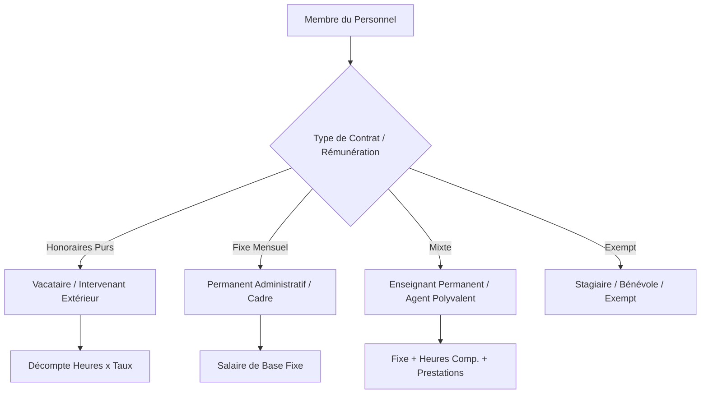
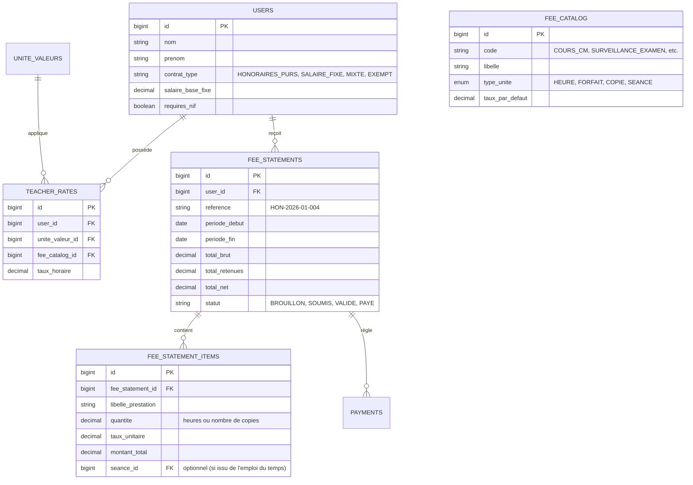
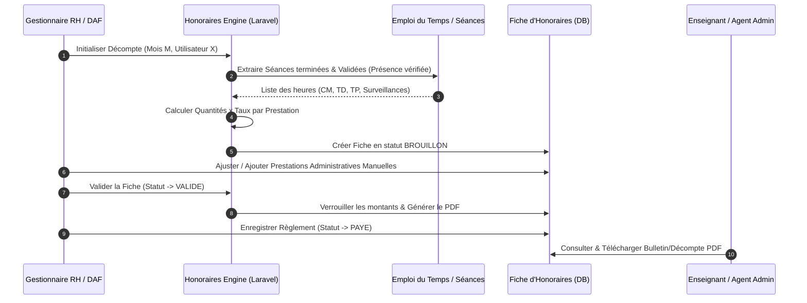

# Spécification Fonctionnelle & Technique : Gestion des Honoraires & Rémunérations

> **Document de Référence & d'Architecture**  
> *Module de décompte des honoraires, salaires et prestations complémentaires pour le personnel enseignant et administratif.*

---

## 1. Vision & Objectifs du Module

L'objectif principal est d'établir un système unifié, flexible et automatisé pour gérer la rémunération et le décompte des honoraires au sein de l'établissement. 

Le système prend en charge :
1. **Les Enseignants Vacataires & Intervenants Extérieurs** : Rémunération aux honoraires basée sur le volume d'heures d'enseignement dispensées (CM, TD, TP) et activités académiques annexes (jurys, corrections).
2. **Le Personnel Administratif & Technique (PAT) & Permanents** : Rémunération fixe mensuelle avec possibilité de décompte d'heures supplémentaires ou de prestations spécifiques (surveillances d'examens/concours, astreintes, commissions).
3. **Le Filtrage & Ciblage du Personnel** : Identification claire du type de contrat de chaque agent afin d'exclure les profils non rémunérés ou exempts (stagiaires, bénévoles).

---

## 2. Classification des Modes de Rémunération

Chaque membre du personnel (User) est rattaché à un **Profil de Rémunération** :

### Table des Types de Contrats :
* **`HONORAIRES_PURS`** : Rémunération calculée exclusivement sur le volume d'heures ou prestations réalisées.
* **`SALAIRE_FIXE`** : Rémunération mensuelle forfaitaire.
* **`MIXTE`** : Salaire de base fixe + paiement des heures complémentaires et vacations.
* **`EXEMPT`** : Aucune génération de fiche d'honoraires ou de bulletin.

---

## 3. Catalogue des Prestations & Tarification

Le système repose sur un catalogue de prestations paramétrables permettant de définir des taux horaires ou forfaitaires.

### A. Prestations Académiques (Enseignement)
| Code Prestation | Intitulé | Unité de Calcul | Application / Exemple |
| :--- | :--- | :--- | :--- |
| `COURS_CM` | Cours Magistral (CM) | Heure | Taux enseignant / Matière (ex: 15 000 FCFA/h) |
| `COURS_TD` | Travaux Dirigés (TD) | Heure | Coefficient ou taux spécifique |
| `COURS_TP` | Travaux Pratiques (TP) | Heure | Encadrement labo / atelier |
| `JURY_SOUTENANCE` | Jury de Soutenance | Forfait / Commission | Forfait par étudiant ou par session |
| `CORRECTION_COPIE` | Correction d'Épreuve | Forfait par copie | Prix unitaire par copie corrigée |

### B. Prestations Administratives & Transversales
| Code Prestation | Intitulé | Unité de Calcul | Application / Concerne |
| :--- | :--- | :--- | :--- |
| `SURVEILLANCE_EXAMEN` | Surveillance d'Examen / Concours | Heure ou Séance | Professeurs & Personnel Administratif |
| `SECRETARIAT_CONCOURS` | Organisation / Secrétariat Concours | Forfait / Journée | Membres du PAT |
| `HEURE_SUP_ADMIN` | Heures Supplémentaires Admin | Heure | Personnel Administratif Permanent/Contractuel |
| `ASTREINTE_LOGISTIQUE` | Astreinte / Permanence | Journée / Week-end | Support informatique & logistique |

---

## 4. Modèle de Données (Base de Données)

---

## 5. Workflow de Calcul & Validation

---

## 6. Composants Frontend & Expérience Utilisateur (Nuxt 3)

1. **Écran de Paramétrage des Taux (`/rh/honoraires/tarifs`)** :
   - Interface de définition des taux par défaut et des dérogations par enseignant / matière.
2. **Console de Génération des Décomptes (`/rh/honoraires/generation`)** :
   - Sélection de la période et filtrage par département / type de personnel.
   - Prévisualisation dynamique du nombre d'heures calculées vs montants.
3. **Gestion des Fiches & Règlements (`/rh/honoraires/liste`)** :
   - Table `Vue3Datatable` récapitulative avec filtre par statut (*Brouillon*, *Validé*, *Payé*).
   - Modal d'enregistrement des règlements avec reçu d'impression.
4. **Portail Collaborateur (`/mon-compte/honoraires`)** :
   - Vue enseignant/personnel pour consulter ses décomptes mensuels et télécharger les bulletins PDF.

---

## 7. Questions Ouvertes & Points à Arbitrer

> [!IMPORTANT]
> **Points de validation pour la prochaine session :**
> 1. **Périodicité des décomptes** : Préférez-vous une génération mensuelle automatique pour tout le monde ou une génération à la demande par période personnalisée ?
> 2. **Règles de retenues fiscales** : Y a-t-il des taxes ou retenues à la source (ex: TPR, impôt sur honoraires) à appliquer automatiquement sur le total brut ?
> 3. **Modalité de validation des séances** : Une séance réalisée par un prof doit-elle obligatoirement être validée par le surveillant/chef de département avant d'être comptabilisée dans ses honoraires ?

---
*Document généré le 31/07/2026 – Enregistré dans le projet frontend pour référence ultérieure.*
